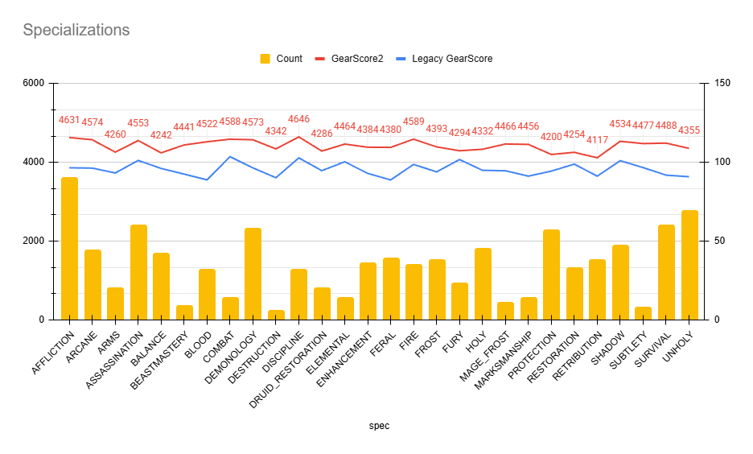

# GearScore2 (WotLK 3.3.5a)

## `GearScore2` is a hobby addon for World of Warcraft 3.3.5a.

It is a smarter PvE-oriented successor to `GearScoreLite: Reborn` (https://github.com/Arcitec/GearScoreLite_Reborn) and a practical alternative to classic `GearScore`.

I am fully aware that the chance of the wider WoW 3.3.5a community abandoning classic `GearScore` and migrating to `GS2` is probably very small, even if that would be the dream outcome.

That is not really the main point.

This addon is first and foremost a functional proof of concept: an attempt to show that a GearScore can be made much more intelligent, more spec-aware, and more useful than the original item-level-heavy model.

Instead of treating item level as the whole story, `GearScore2` tries to answer a more useful question:

> how good is this gear for the actual class and specialization using it?

That means the addon looks beyond legacy base value and takes into account:

- spec compatibility,
- relevant PvE stats,
- gems and enchants,
- PvP stat devaluation in PvE,
- character-level cap progress for important PvE stats.

> [!IMPORTANT]
> - `GearScore2` may conflict with the original `GearScore` addon and with related forks such as `GearScoreLite` and `GearScoreLite: Reborn`.
> - `GearScore2` includes conflict detection for other GearScore-family addons, but it is still strongly recommended to disable the others completely.
> - Run only one addon from that family at a time, because overlapping tooltip hooks, slash commands, globals, or UI elements can cause duplicate lines, inconsistent values, or other unexpected behavior.

## What It Does

`GearScore2` is built around three score families:

- `GearScore2`
  - PvE-aware score focused on gear usefulness for the active or inferred specialization.
- `Legacy GearScore`
  - classic-style baseline score driven mostly by item level and slot value.
- `PvP GearScore`
  - separate PvP-oriented score using PvP stat priorities.

In practice, `GearScore2` is meant to be the score you use when you want a more realistic picture of raid or dungeon gearing quality, while `Legacy GearScore` remains a familiar comparison baseline.

## Why Use It

[GearScore2 Benchmark](https://docs.google.com/spreadsheets/d/1tRMymwR-nn13KqoDOHtIFytayMQhZsvDvcox4lgYlPA/edit?usp=sharing) (Probe from top 40 Naxxramas runs on Warmane)

Classic `GearScore` is fast, but it is also easy to game. It tends to overvalue raw item level, ignores gems and enchants, and does not care whether the item is actually appropriate for the spec wearing it.

`GearScore2` is designed to improve that by:

- rejecting obviously wrong off-role or off-spec gear,
- weighting stats per specialization,
- rewarding useful gems and enchants,
- reducing PvE value of `Resilience`,
- adding a character-level cap layer for important PvE stats.

The result is not meant to be a universal standard. It is an evolving system, but already much closer to real PvE gear quality than a pure item-level score.

## GearScore2 vs Legacy GearScore

| Area | GearScore2 | Legacy GearScore |
|---|---|---|
| Main goal | PvE usefulness | Item-level-style gear estimate |
| Base math | Starts from legacy base, then adjusts | Pure legacy formula |
| Class/spec aware | Yes | No |
| Off-spec filtering | Yes | No |
| Stat weights | Yes, per spec | No |
| Gems | Matching gems add score | Ignored |
| Enchants | Matching enchants add score | Ignored |
| Missing gem/enchant | `+0`, no direct penalty | Ignored |
| PvP `Resilience` in PvE | Reduces score through multiplier | Ignored |
| Character stat caps | Yes, only for final character `GS2` | No |
| Temporary buffs | Tooltip info only, no score impact | Not applicable |
| PvP score | Separate `PvP GearScore` | No dedicated PvP score |
| Same item for different specs | Can score differently | Mostly same outcome |
| Best use | PvE gearing quality | Fast rough comparison |

## Table of Contents

- [1. Purpose](#1-purpose)
- [2. What GearScore2 Measures](#2-what-gearscore2-measures)
- [3. Core GearScore2 Rules](#3-core-gearscore2-rules)
- [4. Character Cap Logic](#4-character-cap-logic)
- [5. Current Limitations / Expectations](#5-current-limitations--expectations)
- [6. Practical Reading Guide](#6-practical-reading-guide)
- [7. Documentation Map](#7-documentation-map)

## 1. Purpose

This README is the high-level overview of the addon.

It explains the intent and the most important runtime behavior without trying to duplicate the full technical specification.

Use this file when you want the product-level model. Use the docs for exact implementation detail.

## 2. What GearScore2 Measures

`GearScore2` is the PvE-oriented score.

It starts from the old item-level-based `Legacy GearScore`, then adjusts the result using gameplay-aware rules:

- class and specialization compatibility,
- weighted PvE stats,
- gems,
- enchants,
- PvE treatment of `Resilience`,
- character-level cap awareness for important PvE stats.

The goal is to score how useful a character's gear is for real PvE performance, not just how high the item level looks.

## 3. Core GearScore2 Rules

### 3.1 Legacy base still matters

Each item still begins with the old legacy base derived from:

- item level,
- rarity,
- slot modifier.

Higher-ilvl gear still matters. It is just no longer the only thing that matters.

### 3.2 Off-spec and obviously wrong gear is rejected

Items can be ignored by `GearScore2` if they are clearly wrong for the class or spec, for example:

- lower-than-expected armor class,
- wrong role category,
- caster-style item on a melee profile,
- melee-style item on a caster profile.

This is one of the biggest differences from `Legacy GearScore`.

### 3.3 Stats are weighted per spec

Each specialization has its own PvE stat profile.

Examples:

- Assassination values `AGI`, `HIT`, `EXPERTISE`, `HASTE`
- tanks value `DEFENSE`, avoidance stats, and other tank-specific defenses
- casters value `SP`, `HIT`, `HASTE`, and spec-specific secondaries

Because of this, the same item can score differently for different specs.

### 3.4 How specialization is matched

For the local player, the addon reads the three talent tabs and picks the tab with the highest point count.

That tab is then mapped through the class-specific specialization order used by the runtime.

For inspected targets, the addon does not wait indefinitely for inspected talent data before producing a useful result.

Instead, once the inspect snapshot is ready, it compares the observed gear against all candidate specs for that class, chooses the highest-scoring match, and marks the result as `[INFERRED]`.

If the inspect snapshot is still incomplete, the tooltip temporarily shows `Scanning...`.

If no explicit specialization is available, item scoring can still fall back to the class default profile.

### 3.5 Gems and enchants can help, but do not punish by themselves

Current runtime behavior:

- a matching gem adds score,
- a matching enchant adds score,
- a non-matching gem gives `+0`,
- a non-matching enchant gives `+0`,
- a missing gem gives `+0`,
- a missing enchant gives `+0`.

So `GearScore2` does not punish empty or bad enhancements directly; it simply refuses to reward them.

### 3.6 Resilience lowers PvE value

`Resilience` is not handled as a flat penalty.

Instead, for PvE it reduces the item result through a multiplier:

- more `Resilience` means lower final PvE value,
- but the item is not automatically worth `0`.

That makes PvP items look worse for PvE than equivalent PvE items, without completely breaking the score.

## 4. Character Cap Logic

The biggest addition on top of item scoring is the character-level cap layer.

This applies only to final character `GearScore2`, not to individual item tooltip scores, `Legacy GearScore`, or `PvP GearScore`.

### 4.1 Why it exists

Some stats are extremely valuable until a cap, then much less valuable after that.

Examples:

- `HIT`
- `SPELL_HIT`
- `EXPERTISE`
- `DEFENSE`
- `ARP`

Without cap logic, a character can appear stronger simply by stacking too much of a stat that has already passed the useful threshold.

### 4.2 How the cap layer works

After all item `GearScore2` values are summed, the addon:

1. aggregates total character stats from gear, gems, and scoreable enchants,
2. resolves the active PvE spec profile,
3. measures progress toward important stat caps,
4. adds a progress-based bonus to final character `GearScore2`.

This cap model uses only permanent sources:

- gear,
- gems,
- scoreable enchants,
- spec passives / talents represented by the cap profile,
- supported racials.

Temporary buffs, elixirs, food, party auras, and target debuffs may still appear in the tooltip as informational context, but they do not change final `GS2`.

### 4.3 Important runtime semantics

- overcap does not reduce cap progress below `100%`
- `ASSASSINATION`, `COMBAT`, and `SUBTLETY` track separate `HIT` and `SPELL_HIT` pools
- caster spell-hit lines are presented as `SPHIT` in the UI
- cap logic is used only for final character `GearScore2`

### 4.4 Inspect behavior

Inspect is asynchronous.

For inspected targets, the addon no longer waits for inspected talent data to produce a useful result:

- while item data is still loading, character and item tooltips show `Scanning...`
- once the inspect snapshot is ready, the addon infers the most likely specialization from the full gear setup
- inferred inspect results are marked as `[INFERRED]`

This was introduced not only for responsiveness, but also because inspected talent API data proved unreliable during debugging and did not always return usable specialization information in time.

`[INFERRED]` makes that fallback explicit instead of pretending the specialization was confirmed directly from talents.

## 5. Current Limitations / Expectations

`GearScore2` is an evolving system, not a frozen standard.

That means:

- spec weights and cap profiles may still be rebalanced,
- inspect results are asynchronous and may briefly show `Scanning...`,
- benchmark reports are aligned with the same permanent cap model used by runtime,
- tooltip informational lines can include temporary cap helpers even though they do not affect score,
- edge cases around unusual gear setups can still improve over time.

## 6. Practical Reading Guide

In practice, `GearScore2` should be read like this:

- high `GearScore2` means the gear is not only high ilvl, but also appropriate and efficient for PvE,
- low `GearScore2` relative to legacy often means the character has:
  - wrong-role items,
  - PvP pieces,
  - weak gem or enchant choices,
  - too much wasted capped stat,
- strong `Legacy GearScore` but weaker `GearScore2` usually means "high item level, lower real PvE efficiency".

`PvP GearScore` is separate on purpose. It exists so PvP-oriented evaluation does not have to distort the PvE-oriented meaning of `GearScore2`.

## 7. Documentation Map

Use the deeper docs when you need exact runtime behavior:

- [docs/GS_ALGORITHM.md](docs/GS_ALGORITHM.md)
  - exact scoring behavior and formulas
- [docs/GS_RUNTIME_TABLES.md](docs/GS_RUNTIME_TABLES.md)
  - runtime constants, spec profiles, cap profiles, and tables
- [docs/GS2_BALANCE_BENCHMARK.md](docs/GS2_BALANCE_BENCHMARK.md)
  - benchmark workflow, output format, and interpretation
